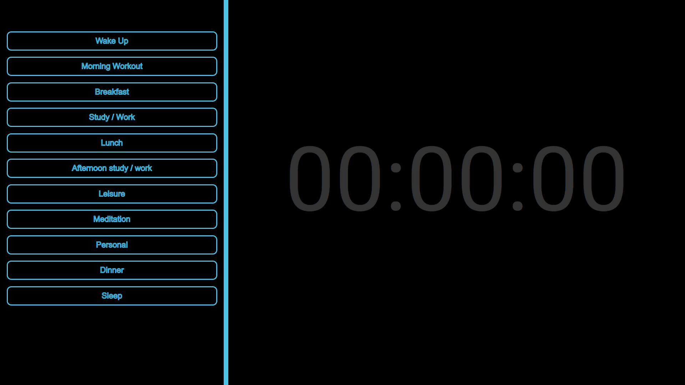

# Webpage

This project is a basic front end web page; languages used : HTML, CSS, Javascript

   So Every day it comprises of many topics which include some of the things that kill most of our time and our mindset not gonna be in one point so to control all these things we need to have a map or daily activity board which we gonna get stuff when we use social media so for all this, we created a web page and its give a clear idea on the things we are spending more time and where we are wasting our time.
   
   Overview of the project:
   
   1. Preset page
      As different people have different lifestyle, we can't preset the daily activity. So there's a customizable preset page which is available and user can enter their daily routine activity.
      
      
      

      
      
   2. Timer page
      This page is the main background running page, the timer automatically adjusts according to the entered routine and alerts the user after every specific activity, if the user is distracted in any other activity then the alert box pops up reminding the things he/she is supposed to do at that time.
      
      
      
